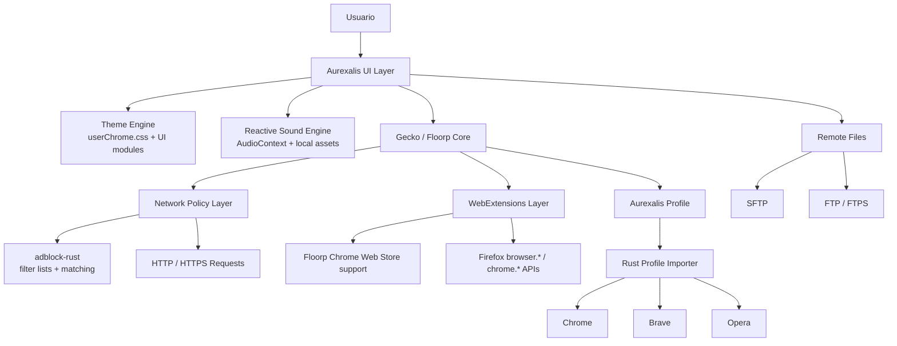
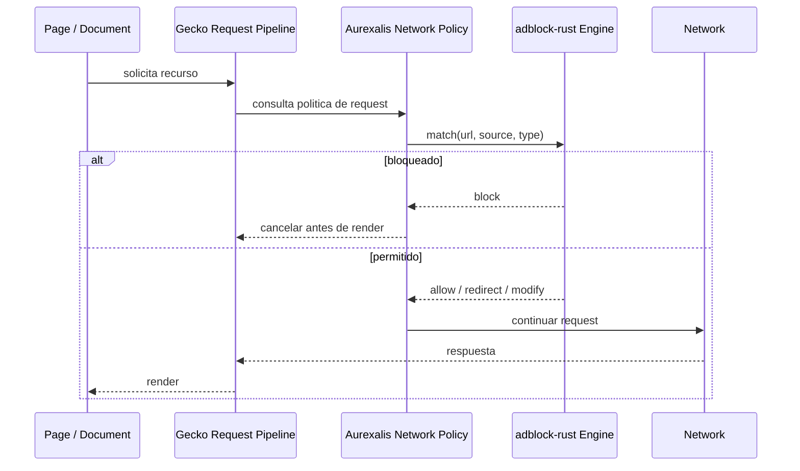
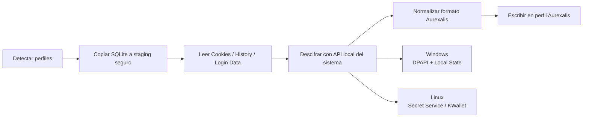
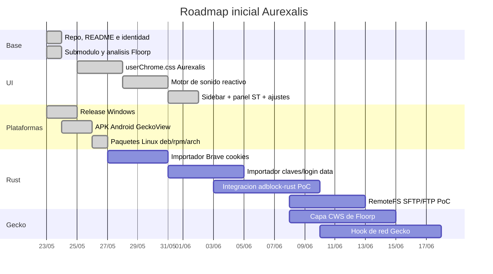

<p align="center">
  
</p>

<div align="center">

# Aurexalis

**Gecko/Floorp core · Brave-grade blocking · Opera GX-inspired UX · purple/red/gold identity**


[](#estado)
[](#arquitectura)
[](#stack)
[](#principios)
[](https://github.com/JackStar6677-1/Aurexalis/actions/workflows/rust.yml)
[](https://github.com/JackStar6677-1/Aurexalis/actions/workflows/android-build.yml)
[](https://github.com/JackStar6677-1/Aurexalis/releases)

</div>

## Vision

**Aurexalis** es un proyecto personal para construir un navegador propio mediante kitbashing serio: tomar componentes open-source maduros, integrarlos con criterio y evitar cargar con la pesadez de una base Chromium completa.

La base prevista es **Floorp/Firefox sobre Gecko**, con una interfaz personalizada tipo gaming, bloqueo nativo de red, compatibilidad fuerte con WebExtensions y herramientas locales de migracion desde navegadores Chromium.

No busca ser un fork cosmetico. La idea es una plataforma personal, optimizada y modular.

## Estado

> Fase actual: **v0.3.0 — shell ejecutable, UI Aurexalis integrada, bloqueador, ajustes y releases multi-plataforma**.

Disponible hoy:

- **Windows:** instalador GUI, CLI portable y runtime zip.
- **Android:** APK GeckoView con home, ajustes y bloqueador ContentBlocking.
- **Linux:** `.deb` (Ubuntu/Debian), `.rpm` (Fedora/RHEL), `.pkg.tar.zst` (Arch) y tarball portable.

El chrome del navegador (`browser/chrome/*.uc.js`) carga sidebar, sonidos, bloqueador, panel **ST** y pagina de ajustes interactiva. Floorp sigue como submodulo auditable en `vendor/floorp` para build Gecko y capa Chrome Web Store.

## Descargas

Cada tag `v*` publica un [GitHub Release](https://github.com/JackStar6677-1/Aurexalis/releases) con:

| Plataforma | Artefactos |
|---|---|
| **Windows** | `Aurexalis-Setup-x86_64.exe`, `aurexalis-windows-x86_64.exe`, `aurexalis-runtime-windows-x86_64.zip` |
| **Android** | `Aurexalis-android-{version}-gecko.apk` |
| **Linux** | `aurexalis_{version}_amd64.deb`, `aurexalis-{version}-1.x86_64.rpm`, `aurexalis-{version}-x86_64.pkg.tar.zst`, `aurexalis-runtime-linux-x86_64.tar.gz` |

En Linux necesitas **Firefox o Floorp** instalado como motor Gecko; el paquete Aurexalis aporta shell, tema, chrome y prefs.

Detalle de build y empaquetado: [docs/BUILD_AND_RELEASE.md](./docs/BUILD_AND_RELEASE.md).

## Principios

- **Gecko primero:** compatibilidad moderna sin convertir Aurexalis en otro Chromium.
- **Rust donde duela:** modulos de alto rendimiento para red, migracion, parsing y filtros.
- **Privacidad local:** datos de perfiles, cookies y claves se procesan localmente con consentimiento explicito.
- **UI reactiva:** estetica Aurexalis en morado profundo, rojo neon y dorado brillante, con animaciones, barra lateral y sonido local.
- **Modularidad real:** cada pieza debe poder probarse aislada antes de entrar al navegador.
- **Rendimiento visible:** bloquear antes de renderizar, cachear donde corresponda y evitar trabajo inutil.

## Nombre

**Aurexalis** mezcla la raiz aurea/dorada de `AureonVault` con el cierre astronomico de `Coronalis` y `AuroralisStar`. La intencion es que suene a una pieza del mismo universo de repositorios, pero con identidad propia para un navegador.

## Arquitectura



## Modulos

| Modulo | Objetivo | Base tecnica |
|---|---|---|
| `aurexalis-ui` | Interfaz morado/rojo/dorado, sidebar, tabs, animaciones y estilo propio | Firefox chrome UI, CSS, JS |
| `aurexalis-sound` | Sonidos reactivos de click, hover, tipeo y acciones de UI | JavaScript, AudioContext, assets locales |
| `aurexalis-blocker` | Bloqueo de anuncios y rastreadores (Gecko ETP en desktop, ContentBlocking en Android; crate `adblock-rust` listo para hook de red) | Rust, prefs Gecko, `adblock-rust` |
| `aurexalis-importer` | Migracion local de cookies, historial, marcadores, favicons, preferencias, claves y contrasenas | Rust, SQLite, JSON, DPAPI, Secret Service/KWallet |
| `aurexalis-remotefs` | Explorador integrado para SFTP, FTP y FTPS estilo gestor de archivos | Rust, credenciales del SO, UI interna |
| `aurexalis-extensions` | Compatibilidad con Chrome Web Store sobre Gecko | Floorp, WebExtensions, manifests |
| `aurexalis-profile` | Perfil local endurecido, preferencias y defaults | Firefox prefs, policies, profile templates |

## Stack

<div align="center">


<br />


</div>

## Flujo De Red



## Migracion De Perfil

El importador sera una herramienta local y explicita. No inicia sesion en cuentas por ti ni envia datos fuera del equipo.



Alcance previsto:

- Cookies de Chrome, Brave y Opera.
- Historial, marcadores/bookmarks y favicons.
- Preferencias basicas del perfil cuando sea seguro migrarlas.
- Claves y contrasenas guardadas cuando el sistema permita descifrado local.
- Importacion controlada hacia el perfil Aurexalis.

## Archivos Remotos

Aurexalis tambien tendra un modulo de navegador de archivos remoto: conexiones SFTP, FTP y FTPS dentro del propio navegador, pensado como una alternativa integrada a montar unidades tipo RaiDrive.

El modulo se documenta en [docs/REMOTE_FS.md](./docs/REMOTE_FS.md) y queda separado para implementarlo despues sin mezclarlo con el motor web.

## Base Floorp

Floorp esta integrado como submodulo Git en `vendor/floorp` para mantener una
referencia auditable al nucleo Gecko elegido.

```powershell
git submodule update --init --depth 1 vendor/floorp
.\tools\floorp-status.ps1
```

El analisis de parches, build system, empaquetado y soporte Chrome Web Store se
mantiene en [docs/FLOORP_INTEGRATION.md](./docs/FLOORP_INTEGRATION.md).

## UI Aurexalis

Paleta inicial:

| Token | Color | Uso |
|---|---:|---|
| `--ax-bg` | `#08050F` | fondo raiz |
| `--ax-surface` | `#120A1E` | barras, sidebar, paneles |
| `--ax-surface-2` | `#1E102D` | tabs y controles |
| `--ax-purple` | `#6F38FF` | profundidad y energia secundaria |
| `--ax-red` | `#FF1F55` | acento principal tipo GX |
| `--ax-gold` | `#FFD166` | foco, premium y acciones destacadas |
| `--ax-text` | `#F7F2FF` | texto principal |

### Barra lateral

Accesos del dock vertical (`browser/chrome/aurexalis-05-sidebar.uc.js`):

| Boton | Funcion |
|---|---|
| **AX** | Home Aurexalis |
| **GX** | GX Corner |
| **RF** | Archivos remotos (panel + backend Rust) |
| **BM** | Marcadores |
| **DL** | Descargas |
| **IM** | Importador Chromium local |
| **BL** | Bloqueador on/off rapido |
| **PW** | Contrasenas (`about:logins`) |
| **ST** | Panel de ajustes integrado |

### Modulos chrome (orden de carga)

`userChrome.js` carga en serie:

1. `aurexalis-00-core.uc.js` — prefs y launcher
2. `aurexalis-01-brand.uc.js` — identidad visual
3. `aurexalis-02-blocker.uc.js` — bloqueador Gecko ETP
4. `aurexalis-03-sound.uc.js` — sonidos reactivos
5. `aurexalis-04-settings-panel.uc.js` — panel **ST**
6. `aurexalis-05-sidebar.uc.js` — sidebar
7. `aurexalis-06-settings-inject.uc.js` — puente prefs en pagina de ajustes

### Ajustes y bloqueador

Preferencias bajo el prefijo `aurexalis.*` (editables desde **ST** o desde `browser/settings/`):

- **Sonidos:** master, click, hover, teclado, ambiente, panel
- **UI:** animaciones on/off
- **Bloqueador:** activo, nivel (`standard` / `strict` / `off`), filtros cosmeticos
- **Importacion:** exportacion local Chromium (con opcion de contrasenas bajo consentimiento)

En desktop la pagina `browser/settings/index.html` recibe `AurexalisPrefsBridge` al abrirse en una pestaña. En Android los mismos controles hablan con la app via `aurexalis://pref/set`.

Mas detalle en [docs/UI.md](./docs/UI.md).

## Roadmap



## Primeros Entregables

- [x] Crear repo base.
- [x] Definir identidad visual Aurexalis.
- [x] Documentar arquitectura modular.
- [x] Crear `userChrome.css` inicial.
- [x] Crear `aurexalis-sound` PoC.
- [x] Integrar barra lateral vertical tipo GX.
- [x] Crear workspace Rust modular.
- [x] Disenar `aurexalis-remotefs` para SFTP/FTP.
- [x] Agregar tests unitarios y CI.
- [x] Clonar Floorp como submodulo auditable.
- [x] Mapear build system, empaquetado y soporte Chrome Web Store de Floorp.
- [x] Crear `aurexalis-importer` Rust para leer SQLite/JSON Chromium.
- [x] Probar `adblock-rust` fuera del navegador.
- [x] Agregar shell ejecutable inicial.
- [x] Agregar cola RemoteFS y backend local testeable.
- [ ] Portar capa Chrome Web Store de Floorp con branding Aurexalis.
- [x] Integrar bloqueador (Gecko ETP desktop + ContentBlocking Android).
- [x] Pagina de ajustes interactiva y panel **ST** unificado.
- [x] Release multi-plataforma v0.3.0 (Windows, Android, Linux).
- [ ] Hook de red Gecko con `adblock-rust` en el pipeline de requests.
- [ ] Importacion Chromium nativa en Android.

## Shell Ejecutable

El binario arrancable vive en `aurexalis-shell`:

```powershell
.\tools\aurexalis-build.ps1 -Mode build
.\target\debug\aurexalis.exe profiles
.\target\debug\aurexalis.exe launch "C:\Ruta\A\floorp.exe"
```

**Windows:** descarga en [GitHub Releases](https://github.com/JackStar6677-1/Aurexalis/releases) — `Aurexalis-Setup-x86_64.exe` (recomendado), `aurexalis-windows-x86_64.exe` (CLI) o runtime zip.

**Linux:**

```bash
./tools/package-linux.sh          # genera .deb, .rpm, .pkg.tar.zst y tarball
sudo dpkg -i dist/aurexalis_*_amd64.deb   # Ubuntu/Debian
# o rpm -i / pacman -U segun tu distro
aurexalis --launch-installed
```

**Android:** ver [mobile/README.md](./mobile/README.md). Sincroniza assets web antes del build:

```powershell
.\tools\sync-mobile-assets.ps1
.\tools\bootstrap-android.ps1
```

Verificacion del pack de chrome:

```powershell
.\tools\verify-browser-pack.ps1
```

La documentacion de build y empaquetado esta en
[docs/BUILD_AND_RELEASE.md](./docs/BUILD_AND_RELEASE.md).

## Pruebas

La suite inicial esta documentada en [docs/TESTING.md](./docs/TESTING.md). El CI corre `cargo test` en Linux y Windows y `verify-browser-pack.ps1` en el workflow Rust.

## Profesionalizacion

- [docs/QUALITY.md](./docs/QUALITY.md): gates de calidad y reglas de ingenieria.
- [docs/ROADMAP.md](./docs/ROADMAP.md): fases de producto.
- [CONTRIBUTING.md](./CONTRIBUTING.md): flujo de cambios.
- [SECURITY.md](./SECURITY.md): politica de datos sensibles.
- [docs/adr](./docs/adr): decisiones arquitectonicas.

## Licencia Y Uso

Proyecto personal en etapa temprana. La base publica documenta arquitectura e identidad. Assets propietarios de terceros, como sonidos comerciales o temas cerrados, no se incluyen en este repositorio.

---

<p align="center">
  <strong>Aurexalis</strong><br />
  Morado profundo. Rojo neon. Dorado reactivo. Control local.
</p>
