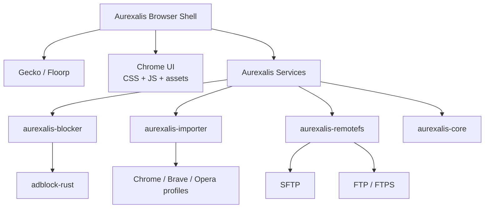

# Arquitectura De Aurexalis

Aurexalis se construye como un navegador basado en Gecko/Floorp, con modulos Rust externos que primero se prueban de forma aislada y luego se integran al nucleo.

## Capas

## Regla De Integracion

Cada modulo debe cumplir tres fases antes de entrar al navegador:

1. Biblioteca local con API estable.
2. CLI o harness minimo para probarlo sin Gecko.
3. Adaptador para conectarlo al shell del navegador.

Esto evita mezclar pruebas de UI, red, perfiles y motor al mismo tiempo.

## Modulos Iniciales

| Modulo | Rol | Estado |
|---|---|---|
| `aurexalis-core` | Tipos compartidos, errores, politicas base | Scaffold |
| `aurexalis-blocker` | Motor de decision para bloqueo de requests | Scaffold |
| `aurexalis-importer` | Deteccion y migracion local de perfiles Chromium | Scaffold |
| `aurexalis-remotefs` | Navegador de archivos remoto SFTP/FTP integrado | Planificado |
| `browser/chrome` | Tema, userChrome y sonido reactivo | Scaffold |

## Decisiones Iniciales

- La base pesada sera Floorp/Firefox, no un motor propio.
- Floorp queda integrado como submodulo auditable en `vendor/floorp`.
- El repositorio empieza como monorepo de integracion para mantener orden.
- Los datos sensibles no se versionan y todo flujo de importacion debe ser local, explicito y auditable.
- El explorador SFTP/FTP sera una funcion de navegador de archivos remoto, no una sincronizacion opaca.

## Base Floorp

El analisis vivo de Floorp esta en [FLOORP_INTEGRATION.md](./FLOORP_INTEGRATION.md).
La revision inicial fijada permite estudiar parches, build system y empaquetado
sin mezclar codigo externo con modulos Aurexalis.

## ADRs

- [ADR 0001: Base Gecko/Floorp](./adr/0001-floorp-gecko-base.md)
- [ADR 0002: Importacion local de perfiles](./adr/0002-local-first-profile-import.md)
- [ADR 0003: RemoteFS sin montaje del sistema](./adr/0003-remotefs-without-os-mount.md)
- [ADR 0004: Floorp como submodulo auditado](./adr/0004-floorp-as-submodule.md)
