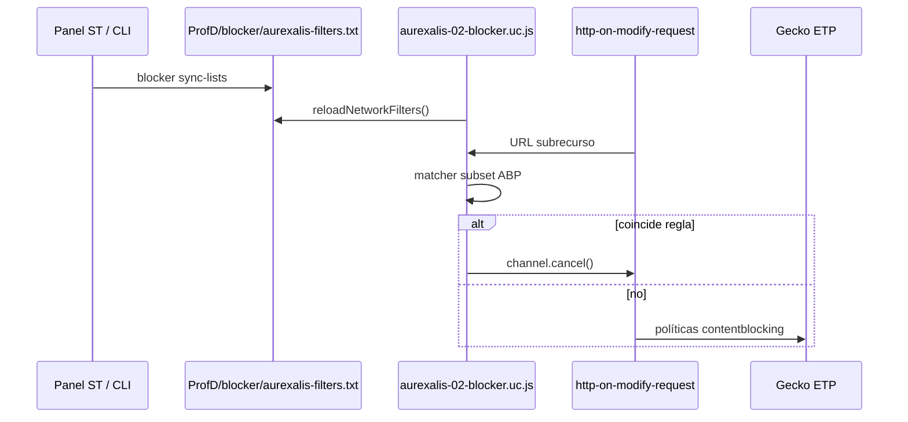

# Hook de bloqueo en el pipeline de red Gecko (v0.5)

Documento de arquitectura para integrar `aurexalis-blocker` (`adblock-rust`) con el navegador Aurexalis.

## Estado actual (v0.5 parcial)

| Capa | Mecanismo | Motor de reglas |
|---|---|---|
| Desktop UI | `aurexalis.blocker.*` + `aurexalis-02-blocker.uc.js` | ETP Gecko + matcher JS en `http-on-modify-request` |
| CLI | `aurexalis blocker check` / `sync-lists` | `adblock-rust` completo |
| Android | `ContentBlocking` + prefs | Gecko (sin hook Rust aún) |
| Listas en perfil | `ProfD/blocker/aurexalis-filters.txt` | Escritas por `sync-lists`, leídas por UC |

## Rutas de integración evaluadas

### 1. UserChrome + observer de red (implementado en v0.5)

**Cómo:** script en `browser/chrome/` registra `Services.obs` en `http-on-modify-request`, cancela `nsIHttpChannel` si la URL coincide con reglas del archivo de perfil.

**Pros:** Sin recompilar Gecko; funciona con Floorp/Firefox + perfil Aurexalis; reutiliza salida de `sync-lists`.

**Contras:** Matcher JS = subset del motor Rust (misma familia que `BlockerBackend::Simple`); no cosmetic ni redirect rules; el observer corre en chrome, no en content processes (suficiente para subrecursos HTTP en la práctica actual).

### 2. WebExtensions / `webRequest` (futuro XPI)

**Cómo:** extensión empaquetada con `webRequestBlocking` o `declarativeNetRequest`.

**Pros:** API estable, sandbox, puede llamar a native messaging.

**Contras:** Manifest v3 limita blocking; empaquetado y firma; duplica UX con UC actual.

### 3. Native messaging + sidecar Rust

**Cómo:** extensión o proceso lanzado por `aurexalis-shell` que consulta `BlockerEngine` por stdin/stdout o socket local.

**Pros:** Paridad total con `adblock-rust` en cada request.

**Contras:** Latencia IPC, ciclo de vida del proceso, permisos en Android distintos.

### 4. Hook C++ en el árbol Gecko/Floorp

**Cómo:** parche en `nsHttpChannel` / `mozilla::net` enlazando `aurexalis-blocker` como biblioteca estática.

**Pros:** Máximo rendimiento y control (estilo Brave).

**Contras:** Build reproducible del núcleo (Fase 5 roadmap); mayor coste de mantenimiento.

### 5. `nsIWebRequest` desde chrome

En Firefox moderno, `nsIWebRequest` está orientado a extensiones. Los UC scripts usan observers de red (`http-on-modify-request`), equivalente práctico para cancelar antes del render de subrecursos.

## Flujo v0.5

## Prefs

| Pref | Rol |
|---|---|
| `aurexalis.blocker.enabled` | Master on/off (ETP + red) |
| `aurexalis.blocker.level` | `standard` / `strict` / `off` |
| `aurexalis.blocker.cosmetic` | `:has()` / filtros cosméticos (futuro) |
| `aurexalis.blocker.debug` | Log de URLs bloqueadas por el hook |

## Paridad CLI vs navegador

- **`blocker check`:** usa `adblock-rust` sobre el mismo archivo de listas cuando existe.
- **Navegador:** matcher JS alineado con `BlockerBackend::Simple` en Rust (dominios `||…^`, paths `/…`, excepciones `@@`, opciones `$script` básicas).

Para reglas complejas (redirect, `$csp`, cosmetic), la CLI puede bloquear y el UC no hasta native hook o XPI.

## Próximos pasos recomendados

1. Listas remotas uBlock/ABP descargadas en `sync-lists` (v0.5+).
2. Prototipo native messaging desde panel **ST** tras `sync-lists`.
3. Benchmark matcher JS vs Rust en CI.
4. Android: puente JNI/UniFFI o ContentBlocking + listas GeckoView.
