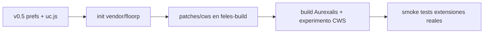

# Port Chrome Web Store (CWS) — Aurexalis v0.5

Plan de integracion de la capa Chrome Web Store de Floorp con branding **Aurexalis**, sin recompilar Gecko en esta fase.

## Estado del submodulo

| Elemento | Estado |
|---|---|
| `vendor/floorp` | **Vacio** hasta `git submodule update --init --depth 1 vendor/floorp` |
| Documentacion previa | `docs/FLOORP_INTEGRATION.md` |
| Capa perfil Aurexalis (v0.5) | **Implementada** — prefs, chrome, ajustes, instalador |

Inicializar Floorp:

```powershell
git submodule update --init --depth 1 vendor/floorp
.\tools\floorp-status.ps1
```

Ver tambien `vendor/floorp/README.md` y `patches/cws/README.md`.

## Arquitectura CWS en Floorp (referencia)

Floorp divide CWS en tres capas. Solo la capa 2 tiene equivalente parcial sin build Gecko.

### 1. Motor Gecko (requiere build Floorp/Aurexalis)

| Ruta (en submodulo) | Rol |
|---|---|
| `browser-features/modules/actors/NRChromeWebStoreChild.sys.mts` | Inyecta boton en paginas CWS, extrae metadata |
| `browser-features/modules/actors/NRChromeWebStoreParent.sys.mts` | Descarga CRX, convierte a XPI, instala via AddonManager |
| `browser-features/modules/modules/chrome-web-store/` | Constantes, CRX converter, manifest transformer, polyfills |
| Experimento | `chrome_web_store_install` via `Experiments.getVariant` |

Sin esta capa **no hay** boton "Add to …" ni instalacion one-click desde la tienda.

### 2. Chrome UI — prompts de instalacion (parcial sin rebuild)

| Ruta | Rol |
|---|---|
| `browser-features/chrome/common/addons/index.ts` | Orquesta observer + override de confirmacion |
| `browser-features/chrome/common/addons/observer.ts` | Topics `floorp-chrome-web-store-install-started`, `webextension-permission-prompt` |
| `browser-features/chrome/common/addons/notification-customizer.ts` | Textos, badge Chrome, aviso compatibilidad |

**Port Aurexalis v0.5:** `browser/chrome/aurexalis-07-cws-brand.uc.js` escucha los mismos topics cuando el motor es Floorp y sustituye textos **Floorp** por **Aurexalis** en los dialogs nativos.

### 3. Prefs y politicas de distribucion

Floorp aplica en **build** (`override.ini` → `firefox.js`):

- `xpinstall.signatures.required = false` (XPI sin firma Mozilla)
- `extensions.htmlaboutaddons.recommendations.enabled = false`
- `extensions.getAddons.showPane = false`

**Port Aurexalis v0.5:** bloque en `browser/prefs/user.js` + bloque generado en instalador (`aurexalis.cws.*`). Las prefs de recomendaciones funcionan en perfil; `xpinstall.signatures` solo con motor Floorp compilado.

Politica de ejemplo para despliegue enterprise: `browser/policies/policies.json.example`.

## Implementado en v0.5 (sin rebuild)

| Entregable | Archivo |
|---|---|
| Rebrand prompts CWS | `browser/chrome/aurexalis-07-cws-brand.uc.js` |
| Estilos badge/aviso | `browser/chrome/userChrome.css` (`.ax-cws-*`) |
| Prefs perfil | `browser/prefs/user.js` (`aurexalis.cws.*`) |
| Instalador | `crates/aurexalis-installer/.../profile.rs` |
| Acceso tienda / gestor | Sidebar **EX**, seccion en `browser/settings/` |
| Verificacion pack | `tools/verify-browser-pack.ps1` |
| Init submodulo | `tools/init-floorp-submodule.ps1` |
| Stub parches futuros | `patches/cws/README.md`, `vendor/floorp/README.md` |

## Diferido (requiere submodulo + build)

1. Renombrar topics/eventos `floorp-*` → `aurexalis-*` en actors Gecko.
2. i18n `chromeWebStore.button.addToFloorp` → `addToAurexalis` en Fluent.
3. Fork `feles-build` / fase `after-mach` con `MOZ_APP_DISPLAYNAME=Aurexalis`.
4. Copiar/adaptar modulos `chrome-web-store/` bajo `patches/cws/` y aplicar con script propio.
5. Habilitar experimento CWS de forma estable (hoy depende de variante Floorp).
6. Polyfills MV3 (offscreen, documentId) — seguir upstream Floorp.

## Flujo de verificacion (Jack)

**Prerrequisito:** motor **Floorp** (o build Aurexalis) con CWS activo en el experimento.

1. Instalar o refrescar perfil Aurexalis (instalador o `rebrand-existing-install.ps1`).
2. `.\tools\verify-browser-pack.ps1` — debe pasar con `aurexalis-07-cws-brand.uc.js`.
3. Abrir `about:addons` — comprobar que no aparecen recomendaciones Mozilla agresivas.
4. Sidebar **EX** → abre gestor + enlace a `chromewebstore.google.com`.
5. En una ficha de extension CWS, pulsar instalar (boton del motor Floorp).
6. En el dialog de permisos/confirmacion, comprobar:
   - Badge **Extensión Chrome** (estilo Aurexalis)
   - Aviso ambar de compatibilidad
   - Texto con **Aurexalis**, no Floorp
7. Si el submodulo esta vacio: `.\tools\init-floorp-submodule.ps1` y revisar `floorp-status.ps1`.

**Limitacion:** con Firefox vanilla (sin parches Floorp) solo aplican prefs de perfil y rebranding de prompts si el topic `floorp-chrome-web-store-install-started` existe; no habra instalacion desde la tienda.

## Roadmap tecnico sugerido (post v0.5)



## Referencias

- [Floorp — Chrome Web Store integration (DeepWiki)](https://deepwiki.com/Floorp-Projects/Floorp/4.6-chrome-web-store-integration)
- `docs/FLOORP_INTEGRATION.md`
- `docs/REBRAND.md`
