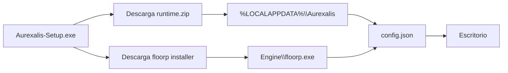

# Instalador Aurexalis (Windows)

## Que hace

`Aurexalis-Setup-x86_64.exe` es el punto de entrada recomendado para usuarios finales.
No sustituye todavia un build Gecko propio: **orquesta** la instalacion de:

1. **Runtime Aurexalis** (shell, `browser/chrome`, prefs) desde el release de GitHub.
2. **Floorp** (motor Gecko) desde el release oficial de Floorp-Projects.
3. **Perfil** `profiles\default` con tema morado/rojo/dorado aplicado.
4. **Acceso directo** en el escritorio que ejecuta `aurexalis.exe --launch-installed`.

## Flujo tecnico



## Desarrollo

El crate vive en `crates/aurexalis-installer` (eframe/egui).

```powershell
cargo build --release -p aurexalis-installer
.\target\release\Aurexalis-Setup.exe
```

Empaquetar runtime manualmente:

```powershell
.\tools\package-runtime.ps1
```

## Limitaciones actuales

- Solo Windows x64.
- Requiere Internet durante la instalacion.
- Floorp se instala con el instalador oficial (`/S /CURRENTUSER`); la firma y EULA son las de Floorp.
- El navegador Aurexalis completo empaquetado (sin depender del instalador de Floorp) es trabajo de la Fase 5 del roadmap.
