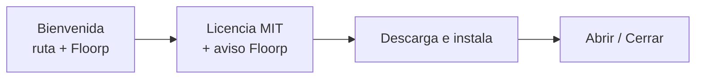

# Instalador Aurexalis (Windows)

## Que hace

`Aurexalis-Setup-x86_64.exe` es el punto de entrada recomendado para usuarios finales.
Orquesta la instalacion de:

1. **Runtime Aurexalis** (shell, `browser/chrome`, prefs, `LICENSE`) desde GitHub Releases.
2. **Floorp** (motor Gecko) desde el release oficial de Floorp-Projects.
3. **Perfil** `profiles\default` con tema morado/rojo/dorado.
4. **Accesos directos** en escritorio y menu Inicio.
5. **Desinstalador** `uninstall.ps1` + acceso directo "Desinstalar Aurexalis".

## Flujo de pantallas



- Idioma **ES / EN** (esquina superior derecha).
- Comprobacion de **500 MB** libres en la unidad destino.
- Icono de marca en ventana y en el `.exe` (`assets/branding/aurexalis.ico`).

## Desarrollo

```powershell
python tools/gen_installer_icon.py
cargo build --release -p aurexalis-installer
.\target\release\Aurexalis-Setup.exe
```

## Desinstalar

Ejecuta **Desinstalar Aurexalis** en el escritorio o:

```powershell
& "$env:LOCALAPPDATA\Aurexalis\uninstall.ps1"
```

Elimina la carpeta Aurexalis y los accesos directos. **No** desinstala Floorp si quedo en otra ruta global.

## Limitaciones

- Solo Windows x64; requiere Internet durante la instalacion.
- Floorp conserva su propia licencia y actualizaciones.
- Build Gecko/Aurexalis empaquetado propio: Fase 5 del roadmap.
