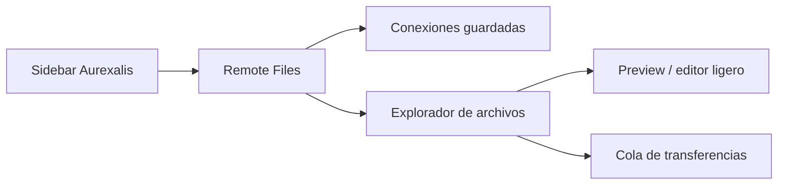

# RemoteFS Integrado

El modulo `aurexalis-remotefs` sera el equivalente interno a una experiencia tipo RaiDrive, pero dentro del navegador: navegar servidores SFTP, FTP o FTPS desde una vista de archivos propia.

## Objetivos

- Conectar a servidores remotos desde Aurexalis sin montar unidades del sistema.
- Mostrar arboles de carpetas, archivos, permisos basicos, tamano y fecha.
- Descargar, subir y reemplazar archivos con confirmaciones claras.
- Evitar lecturas recursivas profundas por defecto.
- Mantener credenciales fuera del repositorio y del log.

## Protocolos

| Protocolo | Uso | Prioridad |
|---|---|---|
| SFTP | servidores seguros, Minecraft, hosting, VPS | Alta |
| FTP | compatibilidad antigua | Media |
| FTPS | FTP con TLS | Media |

## UX Prevista

## Politicas De Seguridad

- No guardar contrasenas en texto plano.
- Permitir perfiles con clave del sistema operativo.
- Confirmar reemplazos y borrados.
- No indexar servidores completos.
- Limitar concurrencia de transferencias.
- Registrar logs limpios sin rutas sensibles completas cuando sea posible.

